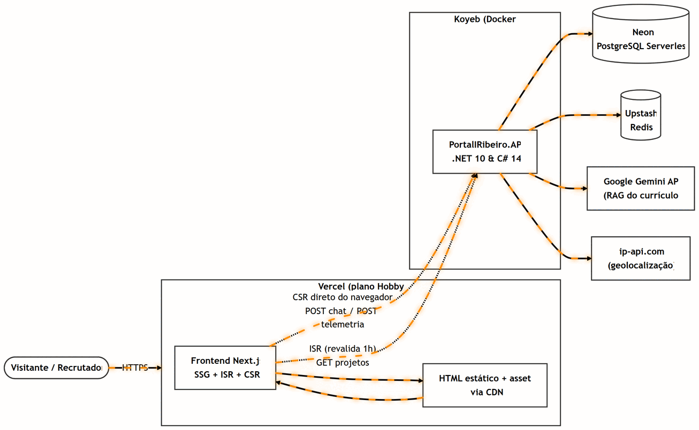
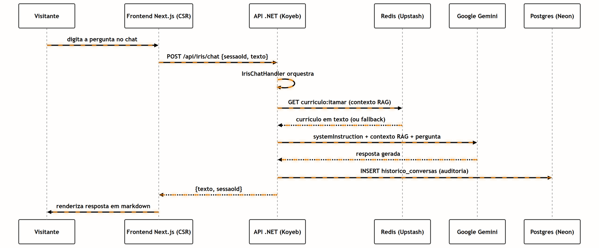

# Portal IRibeiro

Este é meu portfólio profissional e laboratório tecnológico. A aplicação demonstra minha experiência em desenvolvimento **Full Stack**, combinando **.NET/C#**, **Angular**, **PostgreSQL**, **Redis**, **Docker** e integração com **IA/RAG**.

> Resumo: o repositório centraliza a arquitetura do portal, projetado sob os princípios de **Clean Architecture** e focado no ecossistema moderno do .NET, engenharia de dados e inteligência artificial (RAG). A solução é totalmente desacoplada, separando o ecossistema de APIs do front-end para garantir escalabilidade, segurança e custo zero de distribuição para a interface.

---

## 🛠️ Arquitetura Geral da Solução

```text
PortalIRibeiro/
├── docs/                     # Scripts de banco (DDL/Schema), templates de ambiente (.env.sample)
├── PortalIRibeiro.API/       # Lógica de negócio, Web API Core (Minimal APIs, .NET 10 / Native AOT)
├── frontend/                 # Interface SPA em Angular 21 (TypeScript)
├── PortalIRibeiro.slnx       # Arquivo de solução unificado do .NET
└── README.md                 # Documentação principal
```

**Fluxo:** o usuário acessa o HTML estático servido pela Vercel. O Angular chama a API da Koyeb via proxy/rewrite em `/api/*` (mesma origem no browser, a Vercel reencaminha para a Koyeb); chat e telemetria são chamadas **client-side** (CORS liberado), sem intermediário. A API orquestra o RAG no Gemini, persiste histórico/visitas na Neon e usa Redis para cache e dedup de telemetria.



## Módulos em Destaque

### Assistente Inteligente Íris

<p align="center">

</p>

A Íris é um agente de inteligência artificial integrado nativamente ao portal, projetado para interagir com visitantes e recrutadores através de um chat dinâmico, respondendo perguntas estritamente baseadas no meu histórico e trajetória profissional.

Onde está o código? Toda a lógica conceitual está isolada na Feature em [PortalIRibeiro.API/Features/Iris](./PortalIRibeiro.API/Features/Iris).

Como funciona?
* Implementação de RAG (Retrieval-Augmented Generation) consumindo a API oficial do Google Gemini, com **fallback automático** entre modelos (`gemini-3.5-flash-lite` primário → `gemini-3.6-flash` fallback).
* Camada de infraestrutura desacoplada contendo o `GeminiService.cs` para o gerenciamento de prompts e contexto refinado do currículo.
* Armazenamento e persistência do histórico completo de conversas em banco para auditoria e controle de sessões via UUID através do Postgres.

### Fluxo de processamento de perguntas e respostas



---

## Tecnologias Utilizadas
* Back-End: .NET 10 & C# 14 (Minimal APIs, Native AOT, Inversão de Dependência)
* Front-End: Angular 21 (TypeScript), SPA de página única com componentes standalone
* Banco de Dados Cloud: PostgreSQL Serverless hospedado na Neon.
* Cache & Mensageria: Redis gerenciado em nuvem via Upstash.
* Hospedagem API: Aplicação containerizada com Docker (Native AOT) e implantada na Koyeb (plano gratuito).
* Hospedagem Front: Vercel (plano Hobby).

## Frontend (Angular) — Configuração e Renderização

O frontend é uma **SPA Angular 21** renderizada totalmente no cliente (CSR), servida como conteúdo estático pela Vercel. Como não há SSR/SSG, todo o consumo de dados acontece no navegador.

### Como as partes se conectam

- **Componentes standalone:** `Navbar`, `Hero`, `About`, `Laboratory` (projetos), `Services`, `Contact`, `ResumeAssistant` (chat Íris) e `Telemetry`.
- **API via `/api` relativo:** o `environment.prod.ts` usa `apiUrl: '/api'`. Na Vercel, o `frontend/vercel.json` reescreve (`rewrites`) `/api/:path*` para `https://portaliribeiro-api.koyeb.app/api/:path*` — o navegador vê mesma-origem e elimina CORS em produção.
- **Token:** um `HttpInterceptor` (`app-token.interceptor.ts`) injeta o header `X-App-Token` nas chamadas `* /api*`.
- **Proxy local:** em dev (`ng serve`), o `proxy.conf.mjs` encaminha `/api` para `http://localhost:5125` (API local).
- **Markdown:** as respostas do chat são renderizadas com `ngx-markdown`, reproduzindo a saída que o Blazor produzia com Markdig.
- **Estilo:** Bootstrap 5 + Tailwind CSS 4 (PostCSS).
- **Telemetria:** o registro de visita é deduplicado pela API por IP + página num cache Redis de 15 minutos.

### Stack do frontend

| Camada | Tecnologia |
|---|---|
| Framework | Angular 21 + TypeScript 5.9 |
| UI | Bootstrap 5 + Tailwind CSS 4 (via PostCSS) + `styles.css` |
| Dados | `portal-api.service.ts` (fetch via `HttpClient`), `portal.models.ts` |
| Markdown | `ngx-markdown` |
| Testes | Vitest (`ng test`, via `@angular/build:unit-test`) |

## Notas sobre a execução local do projeto

Pré-requisitos
* SDK do .NET 10 instalado (para a API).
* Node.js 20+ (para o frontend).
* Docker ativo na máquina (ambiente Linux testado em base Ubuntu).
* Rider IDE ou um editor de código de sua preferência (como VS Code) com suporte a C#.

### API (.NET)

```bash
cp docs/.env.sample .env    # ajuste as conexões locais (Postgres/Redis/Gemini)
dotnet run --project PortalIRibeiro.API   # http://localhost:5125
```

Alternativa com Docker: `PortalIRibeiro.API/run-container.sh` (lê o `.env` e expõe na porta 5000).

### Frontend (Angular)

```bash
cd frontend
npm install
npm run start               # http://localhost:4200 (proxieia /api para :5125)
```

### Deploy na Vercel

O projeto Angular está em `frontend/` (Root Directory do projeto Vercel). O `frontend/vercel.json` define `buildCommand: npm run build`, `outputDirectory: dist/frontend-angular/browser` e o rewrite de `/api/*` para a Koyeb.

```
https://portaliribeiro-api.koyeb.app/
```

> O rewrite é automático via `vercel.json` — não é necessário definir `NEXT_PUBLIC_API_BASE_URL` (variável da antiga versão Next.js, descontinuada nesta stack).

### Deploy da API na Koyeb

O `Dockerfile` raiz publica a API como binário **Native AOT** e expõe a porta `8080`. No serviço Koyeb (deploy por Git na branch `main`), defina as variáveis de ambiente documentadas em [`docs/.env.sample`](./docs/.env.sample) — seção *KOYEB (PRODUÇÃO)* — como `ConnectionStrings__DefaultConnection`, `ConnectionStrings__Redis`, `Gemini__ApiKey` e `ASPNETCORE_ENVIRONMENT=Production`.