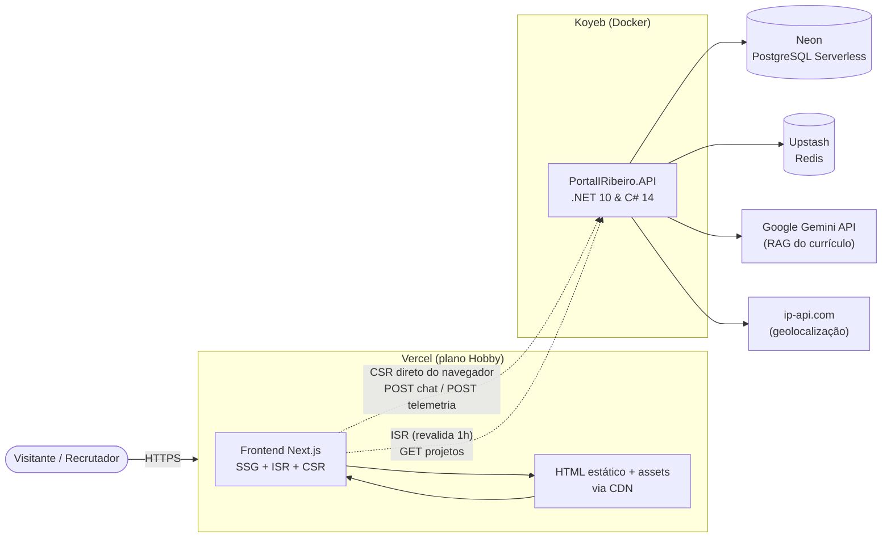

# Portal IRibeiro

Este repositório centraliza a arquitetura do meu portal profissional e laboratório tecnológico, projetado sob os princípios de **Clean Architecture** e focado no ecossistema moderno do .NET, engenharia de dados e inteligência artificial (RAG).

A solução é totalmente desacoplada, separando o ecossistema de APIs do front-end para garantir escalabilidade, segurança e custo zero de distribuição para a interface.

---

## 🛠️ Arquitetura Geral da Solução

```text
PortalIRibeiro/
├── docs/                     # Scripts de banco (DDL/Schema) e templates de ambiente (.env.sample)
├── PortalIRibeiro.API/       # Lógica de negócio, Web API Core, Workers e integrações
├── frontend/                 # Interface SPA em Next.js (App Router + TypeScript)
├── PortalIRibeiro.slnx       # Arquivo de solução unificado do .NET
└── README.md                 # Documentação principal
```



**Fluxo:** o usuário acessa o HTML estático servido pela Vercel. O laboratório é alimentado no build e revalidado a cada 1h (ISR) chamando a API; chat e telemetria são chamadas **client-side direto à API da Koyeb** (CORS liberado), sem intermediário. A API orquestra o RAG no Gemini, persiste histórico/visitas na Neon e usa Redis para cache e dedup de telemetria.

## Módulos em Destaque

### Assistente Inteligente Íris

<p align="center">

</p>

A Íris é um agente de inteligência artificial integrado nativamente ao portal, projetado para interagir com visitantes e recrutadores através de um chat dinâmico, respondendo perguntas estritamente baseadas no meu histórico e trajetória profissional.

Onde está o código? Toda a lógica conceitual está isolada na Feature em [PortalIRibeiro.API/Features/IrisChat](./PortalIRibeiro.API/Features/IrisChat).

Como funciona? 
* Implementação de RAG (Retrieval-Augmented Generation) consumindo a API oficial do Google Gemini.
* Camada de infraestrutura desacoplada contendo o GeminiService.cs para o gerenciamento de prompts e contexto refinado do currículo.
* Armazenamento e persistência do histórico completo de conversas em banco para auditoria e controle de sessões via UUID através do Postgres.
---

## Tecnologias Utilizadas
* Back-End: .NET 10 & C# 14 (Web API Core, Background Services, Inversão de Dependência)
* Front-End: Next.js (App Router + TypeScript) com modelo híbrido SSG/ISR/CSR — detalhado em [Frontend (Next.js) — Configuração e Renderização](#frontend-nextjs--configuração-e-renderização).
* Banco de Dados Cloud: PostgreSQL Serverless hospedado na Neon.
* Cache & Mensageria: Redis gerenciado em nuvem via Upstash.
* Hospedagem API: Aplicação containerizada com Docker e implantada na Koyeb.
* Hospedagem Front: Vercel (plano Hobby).

## Frontend (Next.js) — Configuração e Renderização

O frontend usa o **Next.js App Router** com um modelo de renderização **híbrido**, desenhado para combinar SEO, performance e custo zero dentro do plano gratuito da Vercel.

### Estratégia de renderização por camada

| Camada da página | Modo | Onde |
|---|---|---|
| Home — Hero, About, Services, Contact | **SSG** (prerenderizado no build) | `app/page.tsx` + `components/{hero,about,services,contact}.tsx` |
| Laboratório (projetos) | **ISR** (SSG + revalidação a cada 1h) | `components/laboratory.tsx` via `getProjetos({ revalidate: 3600 })` |
| Chat Íris, Telemetria, Navbar | **CSR** (componentes client) | `components/{resume-assistant,telemetry,navbar}.tsx` |
| Loading / Not Found | SSG | `app/loading.tsx`, `app/not-found.tsx` |

### Como as partes se conectam

- **SSG (Server Components):** a home é 100% pré-renderizada no `next build` e entregue como HTML estático via CDN — carregamento instantâneo e SEO completo.
- **ISR no Laboratório:** a listagem de projetos é buscada da API (`GET api/backoffice/projetos`) no momento do build e revalidada em *background* a cada hora, mantendo o conteúdo fresco sem regenerar a página a cada visita.
- **CSR:** chat, telemetria e menu (hambúrguer) são componentes `"use client"`. O chat chama `POST api/iris/chat` e a telemetria `POST api/telemetria/visita` **direto do navegador contra a API da Koyeb** (CORS liberado). Não há API Routes nem Server Actions como proxy — o plano Hobby da Vercel não cobra por essas requisições.
- **Imagens:** `` nativo em vez de `next/image` para não esbarrar nos limites de otimização de imagem do plano (os avisos `@next/next/no-img-element` no lint são intencionais).
- **Markdown:** as respostas do chat são renderizadas com `react-markdown` + `remark-gfm` (`lib/markdown.tsx`), reproduzindo a mesma saída que o Blazor produzia com Markdig.
- **Estado local:** o limite diário do chat (90/100 perguntas) fica no `localStorage` sob a chave `iris_usage_tracker`, mantendo compatibilidade com a versão anterior do portal.
- **Telemetria:** o registro de visita é protegido contra dupla execução (StrictMode do React em dev) e a própria API deduplica por IP + página num cache Redis de 15 minutos.

### Stack do frontend

| Camada | Tecnologia |
|---|---|
| Framework | Next.js 16 (App Router) + React 19 + TypeScript |
| UI | Bootstrap 5 (via npm) + CSS customizado em `app/globals.css` |
| Dados | `lib/api.ts` (fetch com timeout de 15s), `lib/types.ts` |
| Markdown | `react-markdown` + `remark-gfm` |

## Notas sobre a execução local do projeto

Pré-requisitos
* SDK do .NET 10 instalado (para a API).
* Node.js 20+ (para o frontend).
* Docker e Docker Compose ativos na máquina (ambiente Linux testado em base Ubuntu).
* Rider IDE ou um editor de código de sua preferência (como VS Code) com suporte a C#.

### Frontend (Next.js)

```bash
cd frontend
cp .env.example .env.local   # ajuste a NEXT_PUBLIC_API_BASE_URL se necessário
npm install
npm run dev                  # http://localhost:3000
```

### Deploy na Vercel

O framework é auto-detectado (Next.js). No projeto da Vercel, defina a variável de ambiente de produção:

```
NEXT_PUBLIC_API_BASE_URL=https://portaliribeiro-api.koyeb.app/
```

> Importante: variáveis `NEXT_PUBLIC_*` são embutidas no `next build` — após alterá-las é preciso **redeploy**. O modelo híbrido (SSG + ISR + CSR) cabe com folga no plano Hobby, conforme detalhado na seção de [renderização](#frontend-nextjs--configuração-e-renderização).
